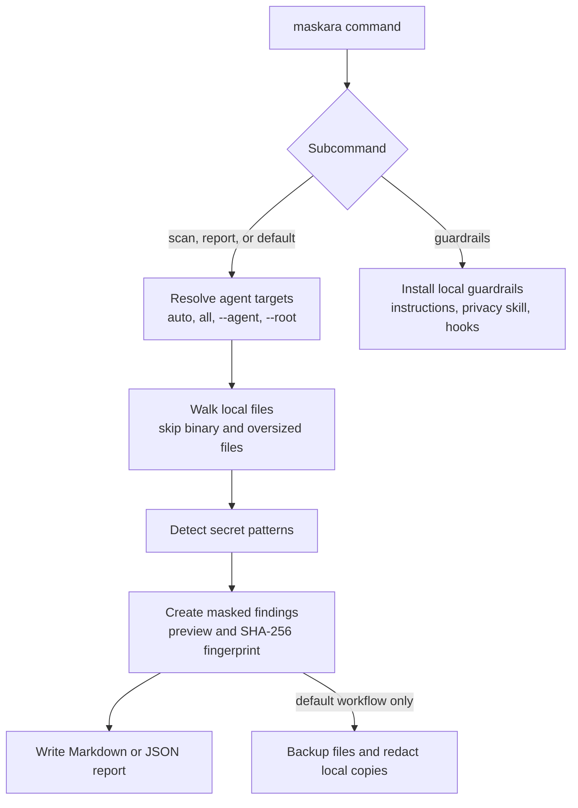

# Maskara

[](https://github.com/mrgoonie/maskara/actions/workflows/ci.yml)

Maskara is an offline CLI for scanning coding-agent session logs, finding
sensitive values, redacting local copies, and producing a rotation report.

Name meaning: `maskara` mixes `mascara` and `mask`. If you do not want to cry
your mascara away after leaking secrets into agent conversations, mask them.

## Install

```bash
go install github.com/mrgoonie/maskara/cmd/maskara@latest
```

Or download a release binary from GitHub Releases.

## Usage

```bash
# full workflow: scan, redact with backups, and write a Markdown report
maskara

# print version
maskara --version
maskara -v

# scan only
maskara scan

# scan only Codex logs
maskara scan --agent codex
maskara scan -a codex

# scan Gemini CLI logs from a custom directory
maskara scan --agent gemini --root /path/to/logs

# scan and report
maskara report

# JSON report
maskara report --json

# write report to a file or directory
maskara report --output /path/to/file.md
maskara report -o /path/to/reports/

# install coding-agent guardrails
maskara guardrails
maskara guardrails -a claude
maskara guardrails -a codex
maskara guardrails --dry-run
```

`maskara` with no subcommand runs the full workflow: scan, redact, and report.
Redaction creates `*.maskara.bak` backups before rewriting files.

## How it works



Maskara stays local: it reads agent logs from disk, reports masked evidence,
and redacts local copies only when the full default workflow runs. It does not
validate secrets with providers or send findings to a remote service.

## Agents

Current target support:

| Agent | Default scan location |
|---|---|
| Claude Code | `~/.claude/projects` |
| Codex | `~/.codex/sessions` |
| Cursor | `~/.cursor` plus platform Cursor config/data dirs |
| OpenCode | `~/.opencode` plus platform config/data dirs |
| Antigravity / Antigravity CLI | `~/.antigravity` plus platform config/data dirs |
| Kimi Code CLI | `~/.kimi` plus platform config/data dirs |
| Droid | `~/.droid` plus platform config/data dirs |
| Gemini CLI | `~/.gemini` plus platform config/data dirs |
| GitHub Copilot | `~/.github-copilot` plus platform config/data dirs |
| Hermes Agent | `~/.hermes` plus platform config/data dirs |
| OpenClaw | `~/.openclaw` plus platform config/data dirs |
| Kilo Code | `~/.kilo-code` plus platform config/data dirs |
| Kiro CLI | `~/.kiro` plus platform config/data dirs |
| Pi CLI | `~/.pi` plus platform config/data dirs |
| Qoder | `~/.qoder` plus platform config/data dirs |
| Qwen Code | `~/.qwen` plus platform config/data dirs |
| Trae | `~/.trae` plus platform config/data dirs |

Use `--root <path>` to scan a custom log directory. Without `--root`,
`--agent all` includes every built-in default target; with `--root`, Maskara
scans that custom directory once and labels findings with the selected agent.
Agent aliases such as `gemini-cli`, `qwen-code`, `kimi-code`, and
`github copilot` normalize to canonical names.

See [Agent Support Reference](docs/agent-support-reference.md) for canonical
names, aliases, path heuristics, and guardrail install behavior.

## Detection

Maskara detects common high-risk patterns:

- OpenAI, Anthropic, GitHub, Slack, Stripe, Google, and AWS token shapes
- JWTs
- private key blocks
- database URLs
- secret-like env assignments

Reports contain masked previews and SHA-256 fingerprints. They do not include
full secret values.

## Guardrails

`maskara guardrails` installs local agent instructions, a small privacy skill,
and hook scripts that discourage commands likely to print secrets. Existing
files are backed up before modification. For agents without a known native
instruction file, Maskara writes a generic `maskara-guardrails.md` reference and
hook under the likely local config root.

Guardrails reduce future leaks. They do not replace secret rotation, provider
revocation, or review of already-shared transcripts.

## Exit Codes

| Code | Meaning |
|---:|---|
| 0 | no findings or guardrail install succeeded |
| 1 | findings detected |
| 2 | runtime error |

## Safety Model

Maskara runs locally and does not validate secrets with remote providers. If a
credential appears in an agent log, assume it may have been exposed and rotate
it. Local redaction removes copies from files on disk only.

## Release Channels

- `dev`: beta branch; each push creates the next `vX.Y.Z-beta.N` prerelease.
- `main`: stable release branch; each push creates the next `vX.Y.Z` official release.
- Version bumps come from conventional commits: breaking changes bump major,
  `feat` bumps minor, and all other releasable changes bump patch.

## References

- [agent-sweep](https://github.com/Ishannaik/agent-sweep)
- [scan-for-secrets](https://github.com/simonw/scan-for-secrets)
- [ggshield](https://github.com/GitGuardian/ggshield)
