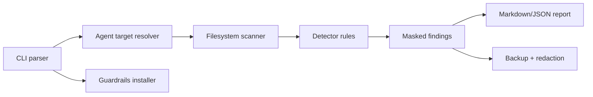

# System Architecture

## Components

## Data Boundaries

Maskara reads local files only. It does not send findings to a network service.
Reports include file paths, line numbers, masked previews, and SHA-256
fingerprints.

## Redaction

Redaction groups findings by file, rejects symlinks, verifies the file is under
a scan target, creates a backup, validates JSON/JSONL when applicable, and then
rewrites matched byte ranges with `[MASKARA_REDACTED:<rule>]`. If raw
replacement would break JSON or JSONL escaping, Maskara falls back to
structured redaction: decode the document or line, redact string values, and
marshal valid JSON back to disk.

## Guardrails

Guardrails write agent-local instruction files, a privacy skill, and hook
scripts when native paths are known. For newer agents without a known native
instruction file, Maskara writes generic local guardrail files under likely
config roots. Existing files are backed up before appending or replacing.

## Unresolved Questions

None.
